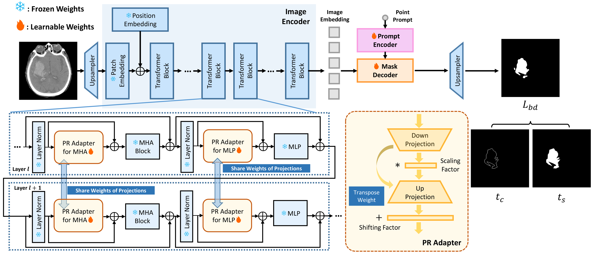

## [SAMIHS: Adaptation of Segment Anything Model for Efficient Intracranial Hemorrhage Segmentation]
#### by Yinuo Wang, Kai Chen, Weimin Yuan, Cai Meng, Xiangzhi Bai

This repository provides a PyTorch implementation of our work submited at ISBI 2024 --> [[**arXiv**]](https://arxiv.org/abs/2311.08190)

## Overview
- **Model**: SAMIHS: A parameter-efficient fine-tuning (PEFT) method 
- **Task**: To adapt the Segment Anything Model (SAM) to intracranial hemorrhage segmentation.
- **Ideas**: The parameter-refactoring adapters and boundary-sensitive loss are incorporated in SAMIHS to improve both efficiency and accuracy.
<p align="center"></p>

## Updates

- 2023.11.13: Code released.

## Usage
### 1. Installation
```bash
$ git clone https://github.com/mileswyn/SAMIHS.git
$ cd SAMIHS/
$ pip install requirements.txt
```

### 2. Checkpoints
We use checkpoint of SAM in [`vit_b`](https://github.com/facebookresearch/segment-anything) version. Please download the pre-trained model and place it at `pretrained/sam_vit_b_01ec64.pth`.

### 3. Data
- We have evaluated our method on two publicly-available datasets: [BCIHM](https://physionet.org/content/ct-ich/1.3.1/) [Instance](https://instance.grand-challenge.org/).
- After downloading the datasets, you can follow the `utils/preprocess.py` to save the slice in `.npy` format, and read them with the information in path `dataset/excel/`.
- The relevant information of your data should be set in [./utils/config.py](https://github.com/mileswyn/SAMIHS/blob/main/utils/config.py) .

### 4. Training
If you have already arranged your data, you can start training your model.
```
cd "/home/...  .../SAMIHS/"
python train.py -task <your dataset name> -sam_ckpt <pre-trained model path> -fold <fold number>
```

### 5. Testing
After finishing training, you can start testing your model.
```
python test.py -task <your dataset name> -sam_ckpt <pre-trained model path> -fold <fold number>
```
Before testing, don't forget modify the "load_path" (the path of your trained model) in [./utils/config.py].

## Citation
If our SAMIHS is helpful to you, please consider citing our [paper](https://arxiv.org/abs/2311.08190):
```
@article{wang2023samihs,
  title={SAMIHS: Adaptation of Segment Anything Model for Intracranial Hemorrhage Segmentation},
  author={Wang, Yinuo and Chen, Kai and Yuan, Weimin and Meng, Cai and Bai, XiangZhi},
  journal={arXiv preprint arXiv:2311.08190},
  year={2023}
}
```

## Acknowledgement
- A lot of code is modified from [SAMUS](https://github.com/xianlin7/SAMUS).
